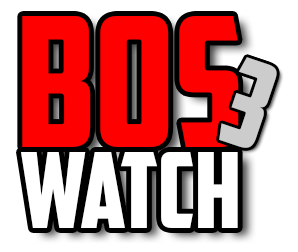

# BOSWatch

**Es wird darauf hingewiesen, dass für die Teilnahme am BOS-Funk nur nach den Technischen Richtlinien der BOS zugelassene Funkanlagen verwendet werden dürfen.**
**Der BOS-Funk ist ein nichtöffentlicher mobiler Landfunk. Privatpersonen gehören nicht zum Kreis der berechtigten Funkteilnehmer.** _(Quelle: TR-BOS)_

### Documentation: [https://docs.boswatch.de](https://docs.boswatch.de)

Wenn dir dieses Projekt gefällt, gib uns bitte einen **STAR**

***

**The intercept of the German BOS radio is strictly prohibited and will be prosecuted. The use is only permitted for authorized personnel.**

If you like this project, please give us a **STAR**
