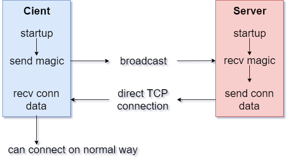

# 
Broadcast Service

Durch den Broadcast Service haben CLients die Möglichkeit, automatisch den Server zu finden und sich mit diesem zu verbinden. Dazu stellt der Server die benötigten Verbinungsinformationen per Broadcast Service bereit.

**Hinweis:** *Server und Client müssen sich im selben Subnetz befinden.*

---
## Aufbau

Der Broadcast Service besteht aus 2 Teilen - einem Server und einem Clienten.  
Nachfolgend soll der Ablauf einer Verbunding des Clienen zum Server mittels des Broadcast Services erklärt werden.

---
## Ablauf

### Schritt 1 - Broadcast Server starten
Im ersten Schritt wird auf dem Server ein zusätzlicher Broadcast Server in einem seperaten Thread gestartet. Dieser lauscht auf einem festgelegten Port auf UDP Broadcast Pakete. Nun kann eine beliebige Anzahl von Clienten mittels des Broadcast Services die Verbinundgdaten des Server abfragen.

### Schritt 2 - Broadcast durch Clienten
Die Client Applikation startet nun zur Abfrage der Verbindungsdaten einen BC Clienten und sendet dort auf dem festgelegten Port ein Paket per UDP Boradcast. Der Inhalt des Paketes ist das Magic-Word `<BW3-Request>` und wird von allen im selben Subnetz vohandenen Gegenstellen empfangen. Nun wird auf eine Antwort des Broadcast Server mit den Verbindungsdaten gewartet.

### Schritt 3 - Verbindungsdaten senden
Wird nun ein Broadcast Paket empfangen, prüft der BC Server die Daten auf das Magic-Word `<BW3-Request>`. Wird dieses erkannt, liest der Server die Absender-IP-Addresse aus dem Paket aus und sendet eine Antwort direkt an diesen Clienten. Dieses Antwortpaket sieht folgendermaßen aus: `<BW3-Result>;8080` wobei die `8080` hier den normalen TCP Kommunikationsport des Server darstellt.

### Schritt 4 - Verbindungsdaten empfangen
Nachdem der Client das direkt an ihn gerichtete Paket mit den Verbindungsdaten vom Server empfangen hat, prüft er auf das Magic-Word `<BW3-Result>`. Ist dieses enthalten wird der Port für die TCP Verbundindung aus dem Paket extrahiert. Außerdem wird die IP-Addresse des Absenders aus dem Paket gelesen.  
Anschließend stehen dem Clienten die Verbindungsdaten des Servers zur Verfügung und er kann sich per TCP über den angegebenen Port mit dem BOSWatch Server verbindden um seine Alarmierungs-Pakete zu versenden.

Da der Broadcast Server in einem eigenen Thread, unabhängig vom Hauptprogram läuft, können ganz einfach weitere Clienten per Broadcast Service die Verbindungsdaten des Servers abrufen.
