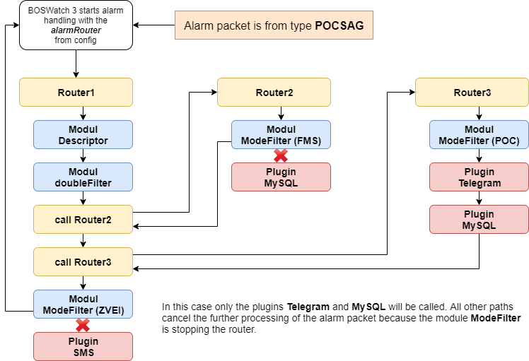

# <center>Routing Mechanismus</center>

BOSWatch 3 hat einen Routing Mechanismus integriert. Mit diesem ist es auf einfache Weise möglich, den Verlauf von Alarmpaketen zu steuern.


---
## Ablauf

Nachfolgender Ablauf soll am Beispiel eines Alarms mit einem Pocsag Paket erklärt werden.

<center></center>

- BOSWatch startet alle Router, welche in der config als `alarmRouter` konfiguriert worden sind (in diesem Fall nur `Router1`)
- Der Router `Router1` beginnt seine Ausführung und arbeitet die einzelnen Routenpunkte sequentiell ab
    - Das Modul `descriptor` wird aufgerufen und fügt ggf. Beschreibungen zum Paket hinzu
    - Das Modul `doubleFilter` wird aufgerufen und blockiert doppelte Alarme  
    (hier würde die Ausführung dieses Routers und damit des kompletten Alarmprozesses stoppen wenn der Alarm als doppelter erkannt würde)
    - Der Router `Router2` wir nun aufgerufen (bis zur Rückkehr aus `Router2` ist der Router `Router1` angehalten)
- Der Router `Router2` beginnt seine Ausführung und arbeitet die einzelnen Routenpunkte sequentiell ab
    - Das Modul `modeFilter` wird aufgerufen und stoppt den Router da es sich nicht um ein FMS Paket handelt
    - Es wird zur Ausführung von `Router1` zurückgekehrt
- Der Router `Router3` beginnt seine Ausführung und arbeitet die einzelnen Routenpunkte sequentiell ab
    - Das Modul `modeFilter` wird aufgerufen und leitet das Paket weiter da es sich um ein Pocsag Paket handelt
    - Das Plugin `Telegram` wird aufgerufen
    - Das Plugin `MySQL` wird augerufen
    - Es wird zur Ausführung von `Router1` zurückgekehrt
- Der Router `Router1` setzt seine Ausführung fort
    - Das Modul `modeFilter` wird aufgerufen und stoppt den Router da es sich nicht um ein ZVEI Paket handelt

Jetzt sind alle Routenpunkte abgearbeitet und die Alarmierung damit abgeschlossen.

---
## Konfiguration

Nachfolgend ist die Router Konfiguration des BW3-Servers für das obige Beispiel zu finden:

```yaml
alarmRouter:
  - Router1

router:
  - name: Router1
    route:
      - type: module
        res: descriptor
        config:
          [...]
      - type: module
        res: filter.doubleFilter
        config:
          [...]
      - type: router
        res: Router2
      - type: router
        res: Router3
      - type: module
        res: filter.modeFilter
        config:
          allowed:
            - zvei
      - type: plugin
        res: sms
        config:
          [...]

  - name: Router2
    route:
      - type: module
        res: filter.modeFilter
        config:
          allowed:
            - fms
      - type: plugin
        res: mysql
        config:
          [...]

  - name: Router3
    route:
      - type: module
        res: filter.modeFilter
        config:
          allowed:
            - pocsag
      - type: plugin
        res: telegram
        config:
          [...]
      - type: plugin
        res: mysql
        config:
          [...]
```
