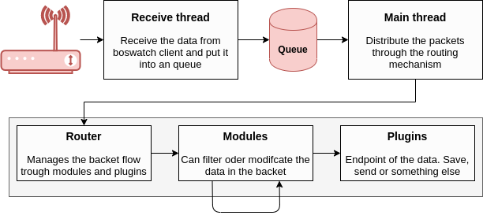

# 
Server/Client Prinzip

BOSWatch 3 wurde als Server/Client Anwedung entwickelt.

Dies ermöglicht es, mehrere Empfangsstationen an einer Auswerte- und Verteilereinheit zu bündeln.

---
## BOSWatch Client

Der **BOSWatch Client** übernimmt den Empfang und die Dekodierung der Daten. Anschließend werden die Daten mittels der implemetierten
Dekoder ausgewertet und in ein sogenanntes bwPacket verpackt.

Dieses Paket wird anschließend in einer Sende-Queue abgelegt. Nun werden Pakete aus der Queue an den BOSWatch Server per TCP-Socket
gesendet. Der Ansatz, Pakete statt dem direkten versenden vorher in einer Queue zwischen zu speichern, verhindert den Verlust von
Paketen, sollte die Verbindung zum Server einmal abreisen. Nach einer erfolgreichen Wiederverbdingun können die wartenden Pakete nun
nachträglich an den Server übermittelt werden.

Dabei überwacht der Client selbstständig die benötigten Programme zum Empfang der Daten und startet diese bei einem Fehler ggf. neu.

---
## BOSWatch Server

Nachdem die Daten vom Clienten über die TCP-Socket Verbindung empfangen wurden, übernimmt der **BOSWatch Server** die weitere
Verarbeitung der Daten.

Auch hier werden die empfangenen Daten in From von bwPacket's in einer Queue abelegt um zu gewährleisten, das auch während einer länger
dauernden Plugin Ausführung alle Pakete korrekt empfangen werden können und es zu keinen Verlusten kommt.
Die Verarbeitung der Pakete geschieht anschließend in sogenannten Routern, welche aufgrund ihres Umfangs jedoch in einem eigenen Kapitel
erklärt werden. Diese steuern die Verteilung der Daten an die einzelnen Plugins.

